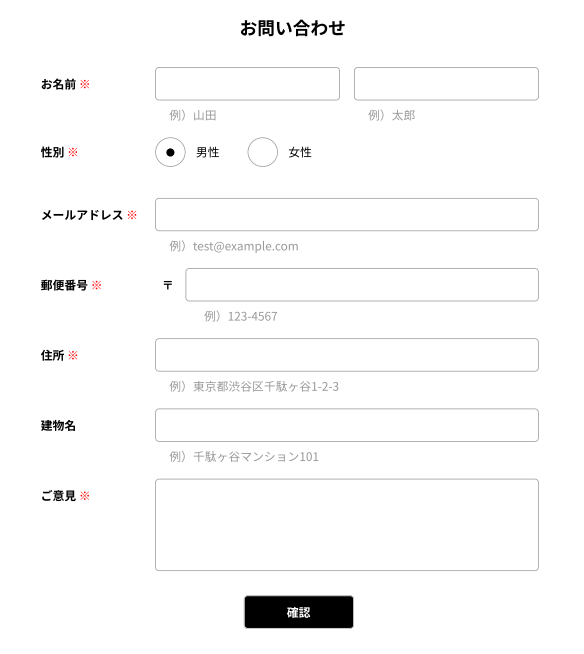
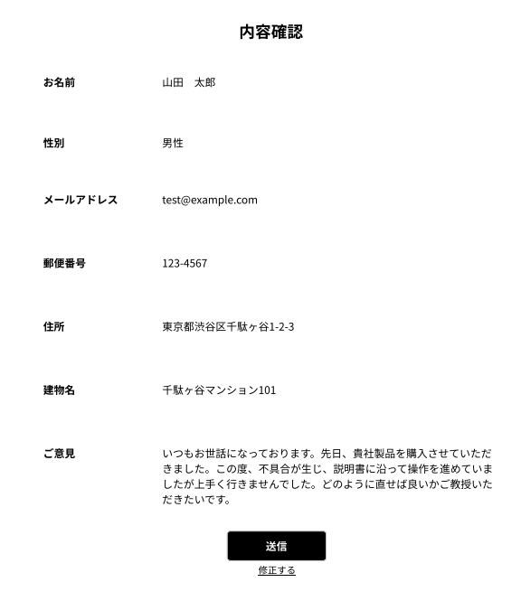
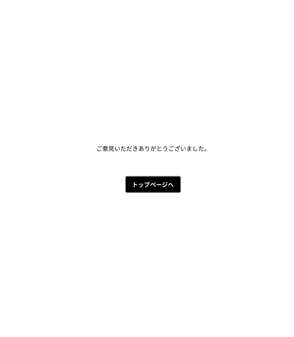
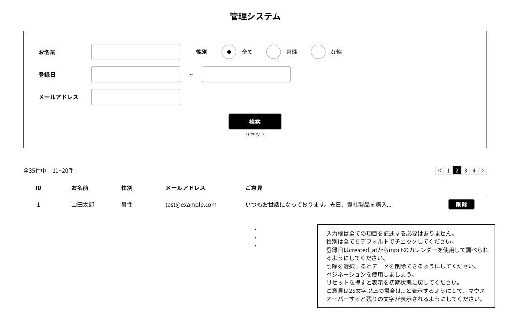

# 問い合わせフォーム
問い合わせ内容を入力，内容を確認し，データベースに追加・管理するアプリ.

## 作成した目的
CoachTechの演習課題として作成.

## 機能一覧
- フォーム入力
- 入力内容確認
- フォーム登録
- フォーム削除
- フォーム検索機能

## 使用技術
- Laravel 8.x
- MySQL

## テーブル設計

## ER図

## その他
